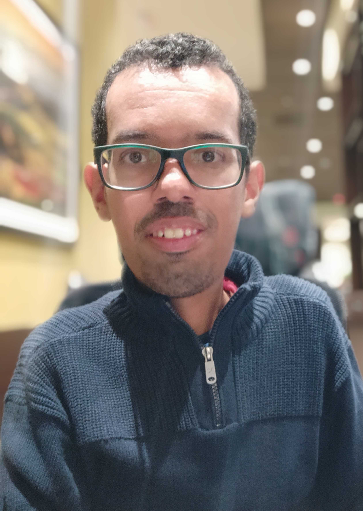

# Guarda Roupa Online - Para Pessoas com Deficiência 

 

 

- [Guarda Roupa Online](#Para-Pessoas-com-Deficiência )
    - [Autor](#autor)
    - [Descrição](#descrição)
    - [Objetivo](#objetivo)
    - [Ferramenta](#ferramenta)
    - [Linguagens](#linguagens)

### Autor:

- **Nome**: Eduardo Silva Rocha
- **Idade**: 34 anos
- **Tipo de deficiência:** Amiotrofia Muscular Espinhal Tipo II, Deficiência Fisica

### Descrição

Bacharelado em Analise e desenvolvimento de sistema pela UNICSUL e estudante de pós-graduação em ciência de dados na Estacio. Trabalho a 6 anos na empresa E3M3 Web Store na area Administrativa.. 

### Objetivo:

Desenvolver um site que cadastra usuario e suas roupas para assim a pessoa com deficiência poder escolher a roupa que usara em cada dia da semana

### Ferramenta:

Visual Studio Code e Xampp

### Linguagens: 

- CSS
- HTML
- JavaScript
- PHP
- SQL

### Referências
